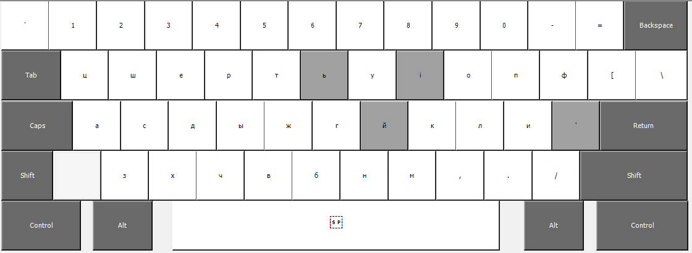

# rue_kb

## About
rue_kb is a Rusyn-language keyboard layout intended for new, anglophone speakers of Rusyn. The layout is meant to provide as familiar an experience as possible to QWERTY keyboard users, while accomodating the larger character set of the Rusyn alphabet.

At this point there is only a Lemko-Rusyn build.

All layouts were created through [Microsoft Keyboard Layout Creator (MSKLC)](https://www.microsoft.com/en-us/download/details.aspx?id=102134).

## Installation
* Visit the release page.
* Download the latest `.zip` file.
* Unzip
* Run `setup.exe`

## Usage
### Layout

The layout adheres very closely to a typical QWERTY layout in that the majority of latin characters are replaced by INFORMAL cyrillic transliterations: `а` replaces `a`, `с` replaces `s`, `в` replaces `v`, and so on. However, looking at the image above you can see that there are a few exceptions to this.

Most notably:
* `ы` is mapped to `f` to facilitate use of that vowel.
* `ф` (the transliteration of `f`) is mapped to `[` as it is used so incredibly infrequently.
* `й` is mapped `j` to facilitate use as a dead key (explained below).
* `ь` is mapped to `y`.

Note: I use the term "transliteration" loosely: these mappings don't strictly follow any established scheme, i.e. `c` produces `ч` instead of `ц`.

### "Dead Keys"
This keyboard makes use of the "dead key" feature of Windows' keyboard layouts. A dead key is essentially just one key that alters the output of another. For instance, pressing `` ` `` then `e` might generate `è`.
This feature is employed in rue_kb to allow the 30+ letters of the Rusyn alphabets to fit on a standard keyboard.

#### List of dead keys:
* `й` produces a corresponding vowels jotation based on its *sound* (not appearance):
  * `a` becomes `я`
  * `e` becomes `є`
  * `і` becomes `ї`
  * `o` becomes `ё`
  * `у` becomes `ю`

* `'` (apostrophe) is a general modifier:
  * `г` becomes `ґ`
  * `ь` becomes `ъ`
  * `ш` becomes `щ`
  * Additional mappings (`ё`, `ы`, `ї`) which may be expanded or removed in a future version.

#### Deprecated Dead Keys
* `і` + `o` becomes the ligature `ю`
* `ь` + `і` becomes the ligature `ы`

